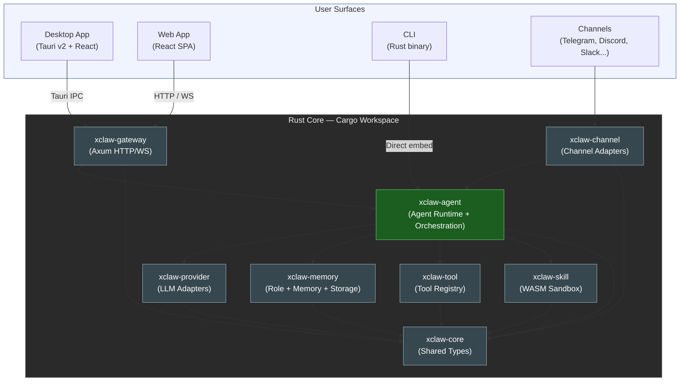
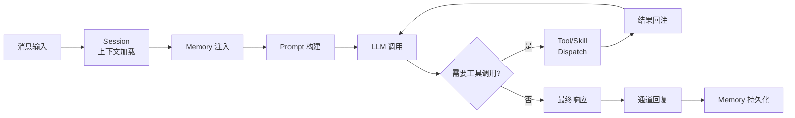
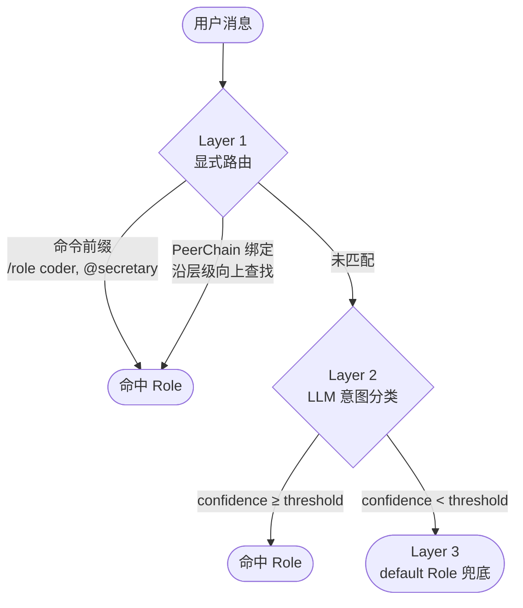
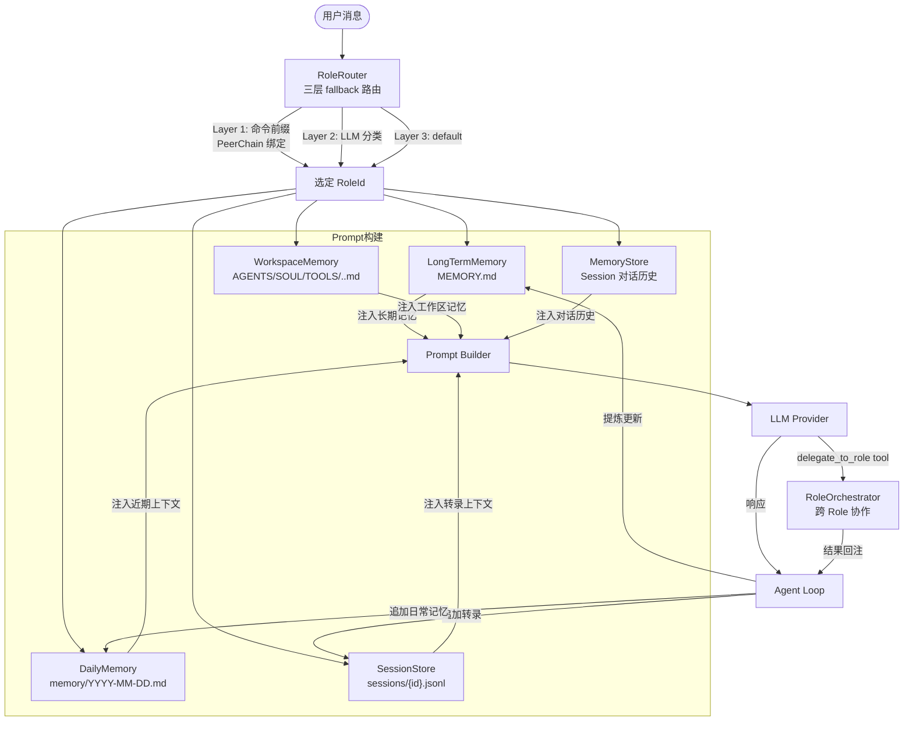
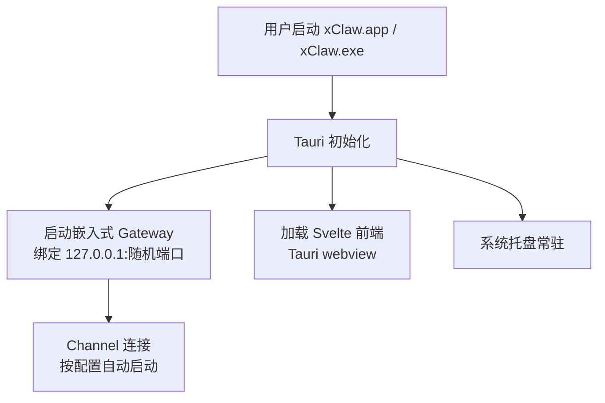
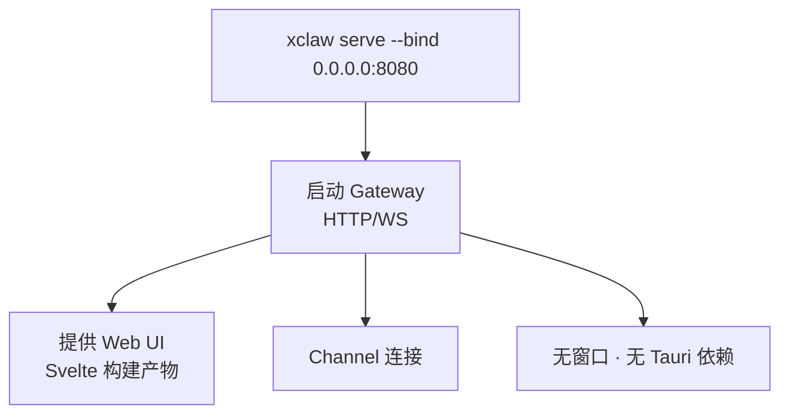
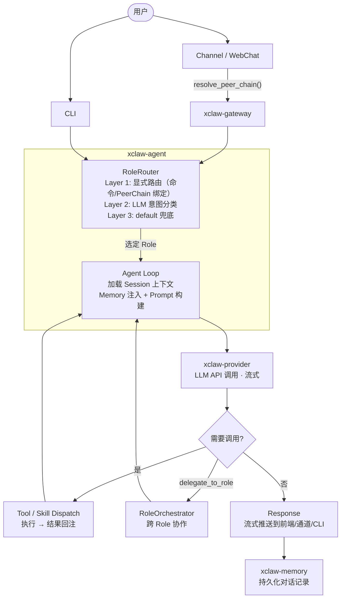
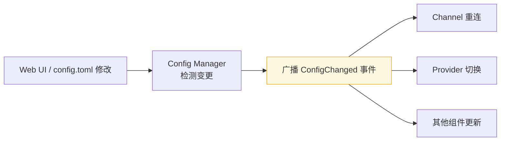

# xClaw 架构设计文档

> 版本：1.0 | 日期：2026-03-22 | 状态：Proposed

## 1. 概述

xClaw 是一个类 OpenClaw 的个人 AI 助手平台，采用 Rust 核心 + Svelte 5 前端的技术栈。支持 macOS/Windows 桌面客户端与云端 Server 部署两种运行模式，面向个人用户使用。

### 1.1 设计目标

| 目标 | 描述 |
|------|------|
| 跨平台 | 原生支持 macOS 和 Windows |
| 轻量高效 | 参照 ZeroClaw 的 Rust 单体二进制理念，追求低内存占用与快速启动 |
| 双模运行 | 桌面模式（Tauri）与服务器模式（Headless + Web UI）共用同一套核心逻辑 |
| 单用户 | 面向个人使用，无需多租户和复杂权限体系 |
| 可扩展 | 通道（Channel）、工具（Tool）、LLM 提供商（Provider）均可插拔 |

### 1.2 非功能性需求

- **启动时间**：< 500ms（桌面模式），< 100ms（CLI 模式）
- **内存占用**：空闲状态 < 30MB（不含 LLM 上下文）
- **并发处理**：支持同时处理多通道消息
- **安全性**：本地密钥加密存储，通道消息端到端不落盘

### 1.3 架构原则

| 原则 | 描述 |
|------|------|
| Trait 定义归属模块 | 每个 Trait 在其所属的业务模块 crate 中定义（如 `MemoryStore`/`RoleManager` 在 `xclaw-memory`，`Tool` 在 `xclaw-tools`，`RoleOrchestrator` 在 `xclaw-agent`），`xclaw-core` 仅存放跨模块共享的基础类型和错误类型 |
| AIOS 兼容 | Role 定义对齐 [AIOS](https://github.com/agiresearch/AIOS) Agent 配置规范（name, description, tools, meta），保持与 AIOS 生态的互操作性 |
| 文件优先 | 用户可见的持久化数据（记忆、Role 配置）优先使用人类可读的文件格式（Markdown, YAML），数据库仅用于性能敏感的结构化查询 |

---

## 2. 高层架构



---

## 3. 项目结构

```
xclaw/
├── Cargo.toml                    # Workspace 根配置
├── crates/
│   ├── xclaw-core/               # 基础定义层（共享类型、错误类型）
│   │   ├── src/
│   │   │   ├── types.rs          # 共享类型（Message, SessionId, RoleId, PeerId, PeerChain, ToolCall 等）
│   │   │   ├── error.rs          # 全局错误类型
│   │   │   └── lib.rs
│   │   └── Cargo.toml
│   ├── xclaw-agent/              # 智能体引擎 + 多智能体编排
│   │   ├── src/
│   │   │   ├── loop.rs           # Agent 循环主逻辑
│   │   │   ├── prompt.rs         # Prompt 构建
│   │   │   ├── session.rs        # 会话管理与隔离
│   │   │   ├── dispatch.rs       # Tool/Skill 调用分发协调
│   │   │   ├── router/           # Role 路由（消息入口 → 选择 Role）
│   │   │   │   ├── mod.rs
│   │   │   │   ├── traits.rs     # RoleRouter trait
│   │   │   │   ├── explicit.rs   # Layer 1: 命令前缀 + PeerChain 绑定查找
│   │   │   │   ├── llm_classifier.rs # Layer 2: LLM 意图分类
│   │   │   │   └── chain.rs      # ChainRouter: 按优先级串联 Layer 1→2→3
│   │   │   ├── orchestrator/     # 多 Role 编排（任务执行中 Role 间协作）
│   │   │   │   ├── mod.rs
│   │   │   │   ├── traits.rs     # RoleOrchestrator trait
│   │   │   │   └── scheduler.rs  # 调度实现（串行/并行/管道）
│   │   │   └── lib.rs
│   │   └── Cargo.toml
│   ├── xclaw-memory/             # 角色管理 + 记忆持久化
│   │   ├── src/
│   │   │   ├── traits.rs         # MemoryStore + LongTermMemory + DailyMemory
│   │   │   ├── role/             # Role 子模块
│   │   │   │   ├── mod.rs
│   │   │   │   ├── config.rs     # RoleConfig 结构体（AIOS 兼容）
│   │   │   │   ├── manager.rs    # RoleManager trait + FsRoleManager 实现
│   │   │   │   ├── long_term.rs  # LongTermMemory trait + 实现
│   │   │   │   └── daily.rs      # DailyMemory trait + 实现
│   │   │   ├── workspace/        # 工作区记忆文件子模块
│   │   │   │   ├── mod.rs
│   │   │   │   ├── types.rs      # WorkspaceFileKind 枚举、WorkspaceSnapshot
│   │   │   │   └── loader.rs     # WorkspaceMemoryLoader trait + FsWorkspaceLoader
│   │   │   ├── session/           # 会话管理子模块
│   │   │   │   ├── mod.rs
│   │   │   │   ├── types.rs      # SessionEntry, SessionIndex, TranscriptRecord, SessionSummary
│   │   │   │   ├── store.rs      # SessionStore trait
│   │   │   │   └── fs_store.rs   # FsSessionStore 实现（JSON 索引 + JSONL 转录）
│   │   │   ├── fs_store.rs       # FsMemoryStore（文件系统记忆实现）
│   │   │   ├── store.rs          # 分层存储（热/温/冷 — 对话历史）
│   │   │   ├── sqlite.rs         # SQLite 温数据层
│   │   │   ├── search.rs         # 向量搜索/FTS5 语义检索（预留）
│   │   │   └── lib.rs
│   │   └── Cargo.toml
│   ├── xclaw-skill/              # 技能系统
│   │   ├── src/
│   │   │   ├── traits.rs         # Skill trait 定义
│   │   │   ├── registry.rs       # 技能注册与发现
│   │   │   ├── loader.rs         # 技能加载（文件系统/内置）
│   │   │   ├── executor.rs       # 技能执行引擎
│   │   │   └── lib.rs
│   │   └── Cargo.toml
│   ├── xclaw-provider/           # LLM 提供商抽象
│   │   ├── src/
│   │   │   ├── traits.rs         # Provider trait 定义
│   │   │   ├── claude.rs         # Anthropic Claude
│   │   │   ├── openai.rs         # OpenAI 兼容
│   │   │   ├── ollama.rs         # 本地 Ollama
│   │   │   └── router.rs         # 模型路由与 Failover
│   │   └── Cargo.toml
│   ├── xclaw-gateway/            # HTTP/WS 控制平面
│   │   ├── src/
│   │   │   ├── http/             # REST API 端点
│   │   │   ├── ws/               # WebSocket 处理
│   │   │   ├── static_files.rs   # 前端静态资源服务
│   │   │   └── lib.rs
│   │   └── Cargo.toml
│   ├── xclaw-channel/            # 消息通道
│   │   ├── src/
│   │   │   ├── traits.rs         # Channel trait 定义
│   │   │   ├── telegram.rs
│   │   │   ├── slack.rs
│   │   │   ├── discord.rs
│   │   │   └── webchat.rs        # 内置 WebChat 通道
│   │   └── Cargo.toml
│   ├── xclaw-tools/              # 原子工具
│   │   ├── src/
│   │   │   ├── traits.rs         # Tool trait 定义
│   │   │   ├── registry.rs       # ToolRegistry 注册与分发
│   │   │   ├── shell.rs          # shell — Shell 命令执行
│   │   │   ├── file.rs           # file_read / file_write / file_edit
│   │   │   ├── git.rs            # git — Git 操作
│   │   │   ├── http.rs           # http — HTTP 请求
│   │   │   ├── browser.rs        # browser — Headless 浏览器 (CDP)
│   │   │   ├── delegate.rs       # delegate_to_role — 跨 Role 委派
│   │   │   ├── cron.rs           # cron — 定时任务调度
│   │   │   └── lib.rs
│   │   └── Cargo.toml
│   └── xclaw-config/             # 配置管理
│       ├── src/
│       │   ├── model.rs          # 配置数据结构
│       │   ├── loader.rs         # 多源配置加载
│       │   ├── secrets.rs        # 密钥安全存储
│       │   └── lib.rs
│       └── Cargo.toml
├── apps/
│   ├── cli/                      # CLI 入口（直接依赖 xclaw-agent）
│   │   ├── src/main.rs           # clap 命令解析
│   │   └── Cargo.toml
│   ├── desktop/                  # Tauri v2 桌面应用
│   │   ├── src-tauri/
│   │   │   ├── src/
│   │   │   │   ├── main.rs       # Tauri 入口
│   │   │   │   ├── commands.rs   # Tauri IPC 命令
│   │   │   │   └── tray.rs       # 系统托盘
│   │   │   ├── Cargo.toml
│   │   │   └── tauri.conf.json
│   │   └── ...                   # 前端由 frontend/ 构建嵌入
│   └── server/                   # Server 模式入口
│       ├── src/main.rs           # Headless 启动
│       └── Cargo.toml
├── frontend/                     # Svelte 5 Web 前端（共享）
│   ├── src/
│   │   ├── lib/
│   │   │   ├── components/       # UI 组件
│   │   │   ├── stores/           # 状态管理
│   │   │   ├── api/              # Gateway API 客户端
│   │   │   └── types/            # TypeScript 类型
│   │   ├── routes/
│   │   │   ├── +page.svelte      # 对话主界面
│   │   │   ├── memory/           # 记忆浏览
│   │   │   ├── config/           # 配置管理
│   │   │   └── monitor/          # 系统监控
│   │   └── app.html
│   ├── package.json
│   ├── svelte.config.js
│   └── vite.config.ts
└── docs/
    └── architecture/
```

---

## 4. 核心组件设计

### 4.1 xclaw-core 基础定义层

`xclaw-core` 是整个系统的类型基石，不包含业务逻辑，仅提供跨模块共享的基础类型。几乎所有其他 crate 都依赖它。

**职责**：
- Shared types：`Message`、`SessionId`、`RoleId`、`PeerId`、`PeerChain`、`ToolCall` 等共享类型
- Error types：全局错误类型层次

> **架构原则**：所有 Trait 定义归属其所属的业务模块 crate（如 `MemoryStore`/`RoleManager` 在 `xclaw-memory`，`Tool` 在 `xclaw-tools`，`RoleOrchestrator` 在 `xclaw-agent`），`xclaw-core` 不定义任何 Trait，仅提供各模块共用的基础类型。

**Peer 层级模型**：

通信实体（Peer）在不同平台上天然存在层级关系（Thread → Channel → Guild/Workspace）。`PeerChain` 表达从最具体到最笼统的层级链，供 Role 路由按层级向上查找绑定：

```rust
/// 通信实体标识（xclaw-core/src/types.rs）
#[derive(Clone, Debug, PartialEq, Eq, Hash)]
pub struct PeerId(pub String);  // 平台内唯一，如 "discord:guild:123/channel:456"

/// 通信实体的层级链，从最具体到最笼统
/// 例：[thread_id, channel_id, guild_id]
#[derive(Clone, Debug)]
pub struct PeerChain(pub Vec<PeerId>);
```

| 平台 | PeerChain 示例 |
|------|---------------|
| Discord | `[thread_id, channel_id, guild_id]` |
| Slack | `[thread_ts, channel_id, workspace_id]` |
| Telegram | `[topic_id, group_id]` 或 `[dm_user_id]` |
| DM（任何平台） | `[user_id]` |

**依赖**：仅 `serde`、`serde_json`、`thiserror` — 零业务依赖

### 4.2 xclaw-agent 智能体引擎

`xclaw-agent` 是系统的核心驱动，负责接收用户消息、构建提示词、调用 LLM、分发 Tool/Skill 调用、管理会话。



**关键设计**：
- 使用 Tokio 异步运行时驱动整个循环
- Tool/Skill 调用采用结构化 JSON Schema 描述，与 LLM 的 function calling 对接
- 支持流式响应（SSE/WebSocket），提升用户体验
- 循环上限保护：单次对话最多 N 轮工具调用，防止失控
- Session Manager 内置于此模块，负责会话创建、上下文隔离与生命周期管理

**Role 路由**（`router/` 子模块）：

用户消息进入后，RoleRouter 决定将消息分派给哪个 Role 处理。采用三层 fallback 策略：



**Layer 1 — 显式路由**（零成本，确定性）：
- **命令前缀**：用户通过 `/role <name>` 或 `@<role_name>` 显式指定
- **PeerChain 绑定查找**：根据消息来源的 `PeerChain`，沿层级向上遍历 `role_bindings.yaml`。例如用户只配置 `#ops → secretary`，该频道下所有新 Thread 自动继承

**Layer 2 — LLM 意图分类**（轻量调用）：
- 将消息 + 所有 Role 的 `description` 发送给轻量模型（如 Haiku），返回 `{ role, confidence }`
- 仅在 Layer 1 未匹配时触发

**Layer 3 — 默认 fallback**：
- confidence 低于阈值时，回落到 `default` Role

```rust
/// Role 路由器（xclaw-agent/src/router/traits.rs）
pub trait RoleRouter: Send + Sync {
    /// 根据消息上下文决定目标 Role
    async fn route(&self, input: &RouteInput) -> Result<RouteDecision, XClawError>;
}

pub struct RouteInput {
    pub message: String,
    pub peer_chain: PeerChain,            // 通信实体层级链
    pub explicit_role: Option<RoleId>,    // 命令前缀显式指定
    pub available_roles: Vec<RoleConfig>,
}

pub struct RouteDecision {
    pub role: RoleId,
    pub confidence: f32,      // 0.0 ~ 1.0
    pub source: RouteSource,  // Explicit | LlmClassified | Default
}
```

**多 Role 编排**（`orchestrator/` 子模块）：

xclaw-agent 同时承担多智能体 Role 的编排职责，支持以下模式：

```rust
/// 多 Role 编排器（xclaw-agent/src/orchestrator/traits.rs）
pub trait RoleOrchestrator: Send + Sync {
    /// 提交任务给指定 Role 执行
    async fn submit(&self, role: &RoleId, task: TaskInput) -> Result<TaskId, XClawError>;
    /// 等待任务完成并获取结果
    async fn await_result(&self, task_id: &TaskId) -> Result<TaskOutput, XClawError>;
    /// 列出所有活跃的 Role 实例
    async fn list_active(&self) -> Result<Vec<RoleStatus>, XClawError>;
    /// 停止指定 Role 实例
    async fn stop(&self, role: &RoleId) -> Result<(), XClawError>;
}
```

**编排模式**（参考 AIOS Scheduler）：

| 模式 | 说明 | 示例 |
|------|------|------|
| 串行委派 | 一个 Role 将子任务委派给另一个 Role | coder 请求 secretary 安排会议 |
| 并行执行 | 多个 Role 同时处理独立任务 | coder 写代码 + secretary 回邮件 |
| 管道协作 | Role 输出作为下一个 Role 的输入 | researcher → writer → editor |

**编排由 Tool 调用触发**：编排不由外部"上帝视角"控制，而是当前 Role 的 LLM 通过调用 `delegate_to_role` tool（见 §4.6）主动发起跨 Role 协作，内部调用 `RoleOrchestrator::submit()`。这与 Agent Loop 的 Tool 调用模式一致。

**与 AIOS 的对应关系**：
- `submit` ↔ AIOS `submitAgent`（提交 agent 执行）
- `await_result` ↔ AIOS `awaitAgentExecution`（等待执行结果）
- `RoleStatus` ↔ AIOS 进程状态（pid, status, agent_name）

**依赖**：`xclaw-core`、`xclaw-provider`、`xclaw-memory`、`xclaw-tools`、`xclaw-skill`、`xclaw-channel`、`xclaw-config`

### 4.3 Provider 抽象层

```rust
// 核心 trait 定义（伪代码）
trait LlmProvider: Send + Sync {
    async fn chat(&self, request: ChatRequest) -> Result<ChatResponse>;
    async fn chat_stream(&self, request: ChatRequest) -> Result<impl Stream<Item = ChatChunk>>;
    fn supported_features(&self) -> ProviderFeatures;
}
```

**路由策略**：
- 主模型 + 降级模型配置
- 自动 Failover：主模型失败后切换到备用
- 按任务类型路由（对话用 Sonnet，复杂推理用 Opus）

**依赖**：`xclaw-core`

### 4.4 xclaw-memory 角色管理与记忆持久化

`xclaw-memory` 负责 Role 的定义、生命周期管理和所有记忆持久化。Role 是 xClaw 中智能体身份与记忆隔离的基本单位，其核心数据（配置、长期记忆、日常记忆）全部围绕文件系统存储展开，因此统一归入 xclaw-memory 管理。

#### 4.4.1 Role 概念

用户可定义不同的 Role 来完成不同工作，每个 Role 拥有独立的配置、system prompt 和记忆工作空间。

```
用户 ──┬── Role: default    （默认角色，通用 AI 助手）
       ├── Role: secretary  （秘书，处理日程和邮件）
       └── Role: coder      （编程助手，代码相关记忆）
```

- 系统内置 `default` Role，用户无需手动创建即可使用
- Role 之间记忆完全隔离
- Role 名称为 `snake_case`，作为文件系统目录名

#### 4.4.2 Role 配置（AIOS 兼容）

Role 配置对齐 [AIOS/Cerebrum](https://github.com/agiresearch/AIOS) Agent 配置规范，保持与 AIOS 生态的互操作性。每个 Role 有一个 `role.yaml` 配置文件：

```yaml
# roles/secretary/role.yaml
name: secretary
description:
  - "负责日程管理、邮件处理和会议记录"
  - "保持专业、简洁的沟通风格"
system_prompt: |
  你是用户的私人秘书，专注于日程管理和沟通协调。
tools:
  - shell
  - file_read
  - file_write
meta:
  author: user
  version: "1.0.0"
  license: private
  created_at: 2026-03-25
```

**与 AIOS Agent config.json 的对应关系**：

| AIOS 字段 | xClaw 字段 | 说明 |
|-----------|-----------|------|
| `name` | `name` | 角色标识符（snake_case） |
| `description` | `description` | 角色描述（字符串数组） |
| `tools` | `tools` | 可用工具白名单 |
| `meta.author` | `meta.author` | 创建者 |
| `meta.version` | `meta.version` | 语义化版本 |
| `meta.license` | `meta.license` | 许可证 |
| `build.entry` / `build.module` | — | AIOS 特有（Python 模块入口），xClaw 不需要 |
| — | `system_prompt` | xClaw 扩展：内置 system prompt |
| — | `meta.created_at` | xClaw 扩展：创建日期 |

#### 4.4.3 文件系统布局

```
~/.xclaw/
├── config.toml                     # 全局应用配置（已有）
├── role_bindings.yaml              # Peer → Role 路由绑定表
├── roles/                          # 所有 Role 的工作空间根目录
│   ├── default/                    # 默认 Role
│   │   ├── role.yaml               # Role 配置文件
│   │   ├── MEMORY.md               # 长期记忆（提炼后的关键信息）
│   │   ├── AGENTS.md               # 工作区协作护栏、规范指导
│   │   ├── SOUL.md                 # AI 人设与语调（Persona & Tone）
│   │   ├── TOOLS.md                # 额外工具引导（非默认白名单的复合工具）
│   │   ├── IDENTITY.md             # AI 自身认同框架
│   │   ├── USER.md                 # 当前人类使用者的技术栈偏好
│   │   ├── HEARTBEAT.md            # 心跳机制 / 长连接轮询应对动作参照
│   │   ├── BOOTSTRAP.md            # 新工作区初始引导规范（仅限新工作区）
│   │   ├── memory/                 # 日常记忆目录
│   │   │   ├── 2026-03-24.md       # 日常记忆（Append-only）
│   │   │   └── 2026-03-25.md
│   │   └── sessions/               # 会话管理目录
│   │       ├── sessions.json       # 会话索引
│   │       ├── {session_id}.jsonl  # 转录文件（JSONL）
│   │       └── ...
│   ├── secretary/
│   │   ├── role.yaml
│   │   ├── MEMORY.md
│   │   ├── AGENTS.md
│   │   ├── SOUL.md
│   │   ├── TOOLS.md
│   │   ├── IDENTITY.md
│   │   ├── USER.md
│   │   ├── HEARTBEAT.md
│   │   ├── BOOTSTRAP.md
│   │   └── memory/
│   │       └── ...
│   └── coder/
│       ├── role.yaml
│       ├── MEMORY.md
│       ├── AGENTS.md
│       ├── SOUL.md
│       └── memory/
│           └── ...
└── data/
    └── memory.db                   # SQLite（预留，向量搜索用）
```

#### 4.4.4 Role Trait 设计

```rust
/// Role 生命周期管理（xclaw-memory/src/role/manager.rs）
pub trait RoleManager: Send + Sync {
    async fn create_role(&self, config: RoleConfig) -> Result<(), XClawError>;
    async fn get_role(&self, role: &RoleId) -> Result<RoleConfig, XClawError>;
    async fn list_roles(&self) -> Result<Vec<RoleConfig>, XClawError>;
    async fn delete_role(&self, role: &RoleId) -> Result<(), XClawError>;
}
```

#### 4.4.5 记忆系统

xclaw-memory 按 `RoleId` 隔离，提供两套正交的记忆能力：

- **角色记忆**（长期 + 日常）：基于文件系统的 Markdown 存储
- **对话历史**：基于内存/SQLite 的会话级消息存储
- **会话管理**：基于文件系统的会话索引和转录持久化（JSON 索引 + JSONL 转录）

#### 4.4.6 记忆类型

| 类型 | 文件 | 用途 | 写入策略 |
|------|------|------|---------|
| 长期记忆 | `MEMORY.md` | 经过提炼的关键决策、用户偏好、持久性事实 | 覆盖写入（提炼更新） |
| 日常记忆 | `memory/YYYY-MM-DD.md` | 日常笔记、运行时上下文、流水账 | Append-only |
| 工作区记忆 | `AGENTS.md` / `SOUL.md` / `TOOLS.md` / `IDENTITY.md` / `USER.md` / `HEARTBEAT.md` / `BOOTSTRAP.md` | 角色人设、协作规范、工具引导等结构化上下文 | LLM 可读可写 |
| 会话转录 | `sessions/{session_id}.jsonl` | 完整对话历史（JSONL 格式） | Append-only |

**长期记忆**（`MEMORY.md`）：
- 由 Agent 在 session 结束时自动提炼，或由用户手动编辑
- 存储经过过滤和总结的持久性知识

**日常记忆**（`memory/YYYY-MM-DD.md`）：
- 每条记录带时间戳前缀，按自然日自动分文件
- 只追加不修改，保证时间线完整性

#### 4.4.7 Memory Trait 设计

```rust
/// 长期记忆：提炼后的关键信息（MEMORY.md）
pub trait LongTermMemory: Send + Sync {
    async fn load(&self, role: &RoleId) -> Result<String, XClawError>;
    async fn save(&self, role: &RoleId, content: &str) -> Result<(), XClawError>;
}

/// 日常记忆：Append-only 流水账（memory/YYYY-MM-DD.md）
pub trait DailyMemory: Send + Sync {
    async fn append(&self, role: &RoleId, entry: &str) -> Result<(), XClawError>;
    async fn load_day(&self, role: &RoleId, date: &str) -> Result<String, XClawError>;
    async fn list_days(&self, role: &RoleId) -> Result<Vec<String>, XClawError>;
}
```

#### 4.4.8 会话管理（Session System）

xclaw-memory 提供基于文件系统的会话索引和转录持久化能力。每个 Role 下维护独立的会话空间。

**双标识符体系**：
- **SessionKey**（`{role_id}:{scope}`）：外部语义标识符，由 channel adapter 定义
- **SessionId**（UUID v4）：内部存储标识符，用于文件名

**存储格式**：
- 会话索引：`sessions/sessions.json`（JSON，含 `version` 字段支持迁移）
- 转录记录：`sessions/{session_id}.jsonl`（JSONL，追加 O(1)）

```rust
/// 会话存储与转录持久化（xclaw-memory/src/session/store.rs）
/// 非 dyn-safe（使用 impl Future），与项目其他 trait 一致。
/// 并发约束：调用方必须保证同一 SessionKey 的操作串行执行。
pub trait SessionStore: Send + Sync {
    fn get_or_create(&self, role: &RoleId, key: &SessionKey)
        -> impl Future<Output = Result<SessionEntry, MemoryError>> + Send;
    fn append_transcript(&self, role: &RoleId, session_id: &SessionId, record: &TranscriptRecord)
        -> impl Future<Output = Result<SessionEntry, MemoryError>> + Send;
    fn load_transcript(&self, role: &RoleId, session_id: &SessionId)
        -> impl Future<Output = Result<Vec<TranscriptRecord>, MemoryError>> + Send;
    fn load_transcript_tail(&self, role: &RoleId, session_id: &SessionId, n: usize)
        -> impl Future<Output = Result<Vec<TranscriptRecord>, MemoryError>> + Send;
    fn session_summary(&self, role: &RoleId, session_id: &SessionId)
        -> impl Future<Output = Result<SessionSummary, MemoryError>> + Send;
    fn delete_session(&self, role: &RoleId, session_id: &SessionId)
        -> impl Future<Output = Result<(), MemoryError>> + Send;
    // ... get_by_id, get_by_key, list_sessions
}
```

**Memory 桥接**：Session 层仅暴露数据读取（`load_transcript` / `load_transcript_tail`）和元数据（`SessionSummary`），Extraction/Injection 逻辑由 `xclaw-agent` 实现。

> 详细设计参见 [session-system.md](session-system.md) 和 [ADR-006](adr/ADR-006-session-system.md)。

#### 4.4.9 与 MemoryStore 的关系

现有 `MemoryStore` trait（session 粒度的 store/recall）保留不动，两者正交：

| 维度 | MemoryStore（已有） | LongTermMemory + DailyMemory（新增） |
|------|---------------------|--------------------------------------|
| 粒度 | Session | Role |
| 数据 | 对话消息 | 提炼的知识 / 日常笔记 |
| 存储 | 内存 + SQLite | 文件系统（Markdown） |
| 搜索 | 向量/FTS（未来） | 全文读取 + SQLite FTS（未来） |

#### 4.4.10 对话历史分层存储（保留）

| 层级 | 存储 | 用途 |
|------|------|------|
| 热数据 | 内存（`DashMap`） | 当前活跃会话上下文 |
| 温数据 | SQLite | 近期对话历史 |
| 冷数据 | 文件系统（JSON） | 历史导出备份 |

#### 4.4.11 SQLite 向量搜索扩展点（预留）

```rust
/// 预留：语义搜索接口（暂不实现）
pub trait MemorySearcher: Send + Sync {
    async fn search(&self, role: &RoleId, query: &str, limit: usize)
        -> Result<Vec<SearchResult>, XClawError>;
    async fn index(&self, role: &RoleId) -> Result<(), XClawError>;
}
```

- 可选集成 `sqlite-vss` 或 `qdrant`（嵌入式模式）
- `memory.db` 放在 `~/.xclaw/data/` 下，不与 Role workspace 耦合

#### 4.4.12 工作区记忆文件（Workspace Memory Files）

工作区记忆文件是 Role 级别的 Markdown 文件，为 Agent 提供结构化的上下文注入。每个文件有明确的语义用途，**LLM 可读可写**。

| 文件 | 语义用途 | 加载时机 | 写入策略 |
|------|---------|---------|---------|
| `AGENTS.md` | 工作区协作护栏、注意事项与规范指导（代码风格、优先使用的指令等） | 构建 Prompt 时读取 | LLM 可写（更新协作规范） |
| `SOUL.md` | AI 人设与语调（Persona & Tone），显式要求代理遵循角色属性 | 构建 Prompt 时读取 | LLM 可写（调整人设） |
| `TOOLS.md` | 额外可用工具引导，告知 LLM 如何理解和调用非默认白名单的复合工具 | 构建 Prompt 时读取 | LLM 可写（注册新工具说明） |
| `IDENTITY.md` | AI 自身认同框架 | 构建 Prompt 时读取 | LLM 可写（更新自我认知） |
| `USER.md` | 当前人类使用者的技术栈偏好等参考 | 构建 Prompt 时读取 | LLM 可写（更新用户画像） |
| `HEARTBEAT.md` | 心跳机制或长连接轮询时的应对动作参照 | 心跳 tick 或会话初始化时 | LLM 可写（调整心跳行为） |
| `BOOTSTRAP.md` | 新工作区创建时触发的初始引导规范（仅限新工作区） | 新工作区首次会话 | LLM 可写（更新引导流程） |

**读取策略**：每次构建 Prompt 时直接从文件系统读取，无缓存、无热加载。这保证了：
- 用户手动编辑文件后，下次对话即刻生效
- LLM 写入文件后，后续对话自动获取最新内容
- 实现简单，无需文件监听依赖

**所有文件均为可选**：文件不存在时跳过，不影响 Agent 正常运行。

**Loader Trait**：

```rust
/// 工作区记忆文件加载器（xclaw-memory/src/workspace/loader.rs）
pub trait WorkspaceMemoryLoader: Send + Sync {
    /// 加载指定 Role 的单个工作区文件，文件不存在返回 Ok(None)
    async fn load_file(
        &self,
        role: &RoleId,
        kind: WorkspaceFileKind,
    ) -> Result<Option<String>, XClawError>;

    /// 写入指定 Role 的工作区文件
    async fn save_file(
        &self,
        role: &RoleId,
        kind: WorkspaceFileKind,
        content: &str,
    ) -> Result<(), XClawError>;

    /// 加载所有工作区文件快照
    async fn load_snapshot(
        &self,
        role: &RoleId,
    ) -> Result<WorkspaceSnapshot, XClawError>;
}
```

**类型定义**：

```rust
/// 工作区文件类型（xclaw-memory/src/workspace/types.rs）
#[derive(Debug, Clone, Copy, PartialEq, Eq, Hash)]
pub enum WorkspaceFileKind {
    Agents,
    Soul,
    Tools,
    Identity,
    User,
    Heartbeat,
    Bootstrap,
}

/// 工作区文件快照
#[derive(Debug, Clone)]
pub struct WorkspaceSnapshot {
    pub files: HashMap<WorkspaceFileKind, Option<String>>,
}
```

#### 4.4.13 数据流



**依赖**：`xclaw-core`

### 4.5 xclaw-skill 技能系统

Skill 是高级编排能力，组合 Prompt 模板与执行逻辑，形成可复用的 Agent 行为模式。

**Skill 与 Tool 的区别**：
- **Tool**：原子操作（shell 执行、文件读写、HTTP 请求），无上下文感知
- **Skill**：高级编排，封装特定领域的 Prompt + 参数 Schema + 执行策略，可被 Agent 在对话循环中调度

```rust
// xclaw-skill/src/traits.rs（伪代码）
trait SkillRegistry: Send + Sync {
    fn register(&mut self, skill: Box<dyn Skill>) -> Result<()>;
    fn get(&self, name: &str) -> Option<&dyn Skill>;
    fn list(&self) -> Vec<SkillInfo>;
}
```

**模块结构**：
- `traits.rs` — Skill trait 定义（核心 Skill trait 在 `xclaw-core` 中，此处扩展 SkillRegistry 等）
- `registry.rs` — 技能注册与发现
- `loader.rs` — 技能加载（文件系统/内置）
- `executor.rs` — 技能执行引擎

**依赖**：仅 `xclaw-core`

### 4.6 xclaw-tools 原子工具层

`xclaw-tools` 提供 Agent 可调用的原子工具能力。每个 Tool 是无状态、无上下文感知的单次操作，与 Skill（高级编排）形成互补。

**Tool trait 定义**：

```rust
// xclaw-tools/src/traits.rs（伪代码）
trait Tool: Send + Sync {
    fn name(&self) -> &str;
    fn description(&self) -> &str;
    fn parameters_schema(&self) -> serde_json::Value;
    async fn execute(&self, ctx: &ToolContext, params: serde_json::Value) -> Result<ToolOutput>;
}
```

**ToolContext**：

每次工具执行时，Agent 构造一个 `ToolContext` 传入 `execute`，携带当前安全边界：

```rust
// xclaw-tools/src/traits.rs（伪代码）
struct ToolContext {
    scope: WorkspaceScope,          // 当前用户/工作区范围
    fs_allowlist: Vec<PathBuf>,     // 文件系统允许列表（默认仅工作区）
    net_allowlist: Vec<String>,     // 网络域名允许列表
    timeout: Duration,              // 超时预算
}
```

**ToolRegistry**：

```rust
// xclaw-tools/src/registry.rs（伪代码）
pub struct ToolRegistry {
    tools: HashMap<String, Box<dyn Tool>>,
}

impl ToolRegistry {
    pub fn register(&mut self, tool: impl Tool + 'static);
    pub fn get(&self, name: &str) -> Option<&dyn Tool>;
    pub fn list_schemas(&self) -> Vec<ToolSchema>;
}
```

内置工具在启动时注册；WASM Skill 也可在运行时动态注册额外工具。

**内置工具集**：

| Tool | Module | Description |
|------|--------|-------------|
| `shell` | `tools::shell` | Execute shell commands (with timeout + output capture) |
| `file_read` | `tools::file` | Read file contents |
| `file_write` | `tools::file` | Write/create files |
| `file_edit` | `tools::file` | Patch files with search-replace |
| `git` | `tools::git` | Git operations (status, diff, commit, log) |
| `http` | `tools::http` | HTTP requests (GET/POST/PUT/DELETE) |
| `browser` | `tools::browser` | Headless browser control via CDP |
| `delegate_to_role` | `tools::delegate` | Delegate a task to another Role (triggers RoleOrchestrator) |
| `cron` | `tools::cron` | Schedule recurring tasks |

**Security**：所有工具在 `ToolContext` 约束下执行，由 Agent 按会话配置构造。文件系统默认仅允许工作区路径，网络请求受域名白名单限制，每次调用受超时预算控制。详见第 8.2 节工具沙箱策略。

**依赖**：`xclaw-core`

### 4.7 Gateway 控制平面

基于 axum 构建的 HTTP/WS 服务器，是 Server/Desktop 模式下外部交互的统一入口。

**REST API**：
| 端点 | 方法 | 说明 |
|------|------|------|
| `/api/chat` | POST | 发送消息 |
| `/api/chat/stream` | GET (SSE) | 流式对话 |
| `/api/sessions` | GET/POST/DELETE | 会话管理 |
| `/api/roles` | GET/POST/DELETE | 角色管理 |
| `/api/memory` | GET/POST/DELETE | 记忆管理 |
| `/api/config` | GET/PUT | 配置读写 |
| `/api/channels` | GET/PUT | 通道状态 |
| `/api/tools` | GET | 工具列表 |
| `/api/skills` | GET | 技能列表 |
| `/api/health` | GET | 健康检查 |

**WebSocket**：
- `/ws/chat` — 实时对话（双向流式）
- `/ws/events` — 系统事件推送（状态变化、通道消息）

**依赖**：`xclaw-core`、`xclaw-agent`

### 4.8 Channel 通道层

```rust
trait Channel: Send + Sync {
    async fn start(&self, sender: MessageSender) -> Result<()>;
    async fn send(&self, message: OutgoingMessage) -> Result<()>;
    async fn stop(&self) -> Result<()>;
    fn channel_type(&self) -> ChannelType;
    /// 解析消息来源的完整 Peer 层级链，供 RoleRouter 使用
    fn resolve_peer_chain(&self, message: &IncomingMessage) -> PeerChain;
}
```

每个 Channel 实现独立运行在自己的 Tokio task 中，通过 `mpsc` channel 与 Agent Loop 通信。

`resolve_peer_chain` 由各平台 adapter 负责实现，将平台特有的层级关系（Thread → Channel → Guild/Workspace）映射为通用的 `PeerChain`。

**依赖**：`xclaw-core`

### 4.9 Config Manager

```
配置加载优先级（高 → 低）：
  1. 命令行参数
  2. 环境变量（XCLAW_*）
  3. 用户配置文件（~/.xclaw/config.toml）
  4. 项目配置文件（.xclaw/config.toml）
  5. 内置默认值
```

密钥使用操作系统原生密钥环存储：
- macOS: Keychain
- Windows: Windows Credential Manager

---

## 5. 运行模式

### 5.1 桌面模式（Tauri v2）



**Tauri IPC 命令**（Rust ↔ 前端通信）：
- 文件对话框、系统通知、剪贴板、窗口控制
- 直接调用 xclaw-agent 函数，跳过 HTTP（性能优化）

### 5.2 CLI 模式

```
xclaw chat "你好"              # 单次对话
xclaw chat --interactive       # 交互式对话
xclaw serve                    # 启动 Server 模式
xclaw config set provider.default claude
xclaw channel list
```

CLI 入口使用 `clap` 解析命令，直接依赖 `xclaw-agent`，无需经过 Gateway。

### 5.3 Server 模式（云端部署）



部署选项：
- Docker 单容器部署
- 直接运行二进制文件
- systemd / launchd 服务

---

## 6. 数据流

### 6.1 对话消息流



### 6.2 配置热更新流



---

## 7. 技术选型总览

| 领域 | 技术 | 理由 | 详见 |
|------|------|------|------|
| 核心运行时 | Rust + Tokio | 高性能、低资源、跨平台编译 | 需求约束 |
| HTTP/WS 框架 | axum | Rust 生态最成熟的异步 Web 框架，Tower 中间件生态 | ADR-001 |
| 桌面 Shell | Tauri v2 | Rust 原生、体积小、macOS/Windows 原生支持 | ADR-002 |
| Web 前端 | Svelte 5 + Vite | 编译时框架、零运行时开销、bundle 小 | ADR-003 |
| 数据存储 | SQLite (rusqlite) | 零依赖嵌入式数据库、单用户场景最优 | ADR-004 |
| 序列化 | serde + toml/json | Rust 标准序列化方案 | — |
| CLI 解析 | clap v4 | Rust 生态标准 CLI 框架 | — |
| 日志 | tracing | 结构化日志 + 分布式追踪 | — |
| 密钥存储 | keyring-rs | 跨平台原生密钥环封装 | — |
| 构建 | Cargo workspace + pnpm | Rust workspace 统一管理，pnpm 管理前端依赖 | — |

---

## 8. 安全设计

### 8.1 密钥管理

- API Key 等敏感信息存储在 OS 原生密钥环中，不落配置文件
- 配置文件中的密钥字段支持 `env:XCLAW_OPENAI_KEY` 引用语法
- 运行时密钥仅在需要时加载到内存，不持久化到日志

### 8.2 工具沙箱

- Shell 工具执行：命令白名单 + 路径限制
- 文件 I/O：工作区隔离，禁止路径穿越
- Web Fetch：可配置域名白名单
- 自治等级（Autonomy Level）：ReadOnly / Supervised / Full

### 8.3 通信安全

- Server 模式建议通过反向代理（Nginx/Caddy）启用 TLS
- WebSocket 连接支持 token 认证
- 桌面模式 Gateway 仅绑定 127.0.0.1

---

## 9. 构建与部署

### 9.1 构建流水线

```
1. pnpm --prefix frontend build     # 构建 Svelte 前端
2. cargo build --release             # 构建 Rust 二进制
   - apps/cli     → xclaw            # CLI + Server 二进制
   - apps/desktop → xClaw.app/.exe   # Tauri 桌面应用（内嵌前端）
   - apps/server  → xclaw-server     # 纯 Server 二进制（无 Tauri 依赖）
```

### 9.2 交叉编译目标

| 平台 | Target | 产物 |
|------|--------|------|
| macOS (Apple Silicon) | `aarch64-apple-darwin` | xClaw.app, xclaw |
| macOS (Intel) | `x86_64-apple-darwin` | xClaw.app, xclaw |
| Windows | `x86_64-pc-windows-msvc` | xClaw.exe, xclaw.exe |
| Linux (Server) | `x86_64-unknown-linux-musl` | xclaw-server |

### 9.3 Docker 部署

```dockerfile
FROM rust:1-alpine AS builder
# 多阶段构建，最终镜像 < 30MB
FROM alpine:3
COPY --from=builder /app/xclaw-server /usr/local/bin/
COPY --from=builder /app/frontend/build /usr/share/xclaw/web
EXPOSE 8080
CMD ["xclaw-server", "--bind", "0.0.0.0:8080"]
```

---

## 10. 可扩展性规划

本项目面向个人使用，但架构预留了合理的扩展点：

| 阶段 | 规模 | 架构不变 |
|------|------|---------|
| 当前 | 单用户 | 嵌入式 SQLite + 单进程 |
| 未来可选 | 家庭/小团队 | 添加简单 token 认证，数据库不变 |
| 极端场景 | 多设备同步 | 替换 SQLite 为 PostgreSQL，添加同步层 |

**插件扩展点**：
- `Provider` trait：新增 LLM 后端
- `Channel` trait：新增消息通道
- `Tool` trait：新增原子工具能力
- `Skill` trait：新增高级技能编排
- `RoleRouter` trait：自定义 Role 路由策略（如增加基于向量相似度的语义路由层）
- `RoleManager` / `RoleOrchestrator` trait：自定义角色管理和多智能体编排策略
- `LongTermMemory` / `DailyMemory` trait：自定义记忆存储后端（如云同步、加密存储）
- 前端组件：Svelte 组件化架构天然支持扩展

---

## 11. 关键设计决策

详见 ADR 文档：

- **ADR-001**：选用 axum 作为 Gateway 框架
- **ADR-002**：选用 Tauri v2 作为桌面 Shell
- **ADR-003**：选用 Svelte 5 作为前端框架
- **ADR-004**：选用 SQLite 作为数据存储
- **ADR-005**：采用 Role-based 文件优先记忆体系
- **ADR-006**：Session System 架构（文件系统会话索引 + JSONL 转录持久化）

---

## 12. 风险与缓解

| 风险 | 影响 | 缓解策略 |
|------|------|---------|
| Tauri v2 WebView 在 Windows 上兼容性问题 | 部分旧 Windows 系统 WebView2 缺失 | 安装包内嵌 WebView2 Bootstrapper |
| LLM API 调用延迟影响用户体验 | 对话响应慢 | 流式响应 + 本地 Ollama 降级 |
| SQLite 并发写入限制 | 多通道同时写入冲突 | WAL 模式 + 写入队列序列化 |
| 前端与桌面共享带来的耦合 | 维护复杂度增加 | 前端通过 API 客户端抽象通信层，Tauri IPC 仅作性能优化路径 |
